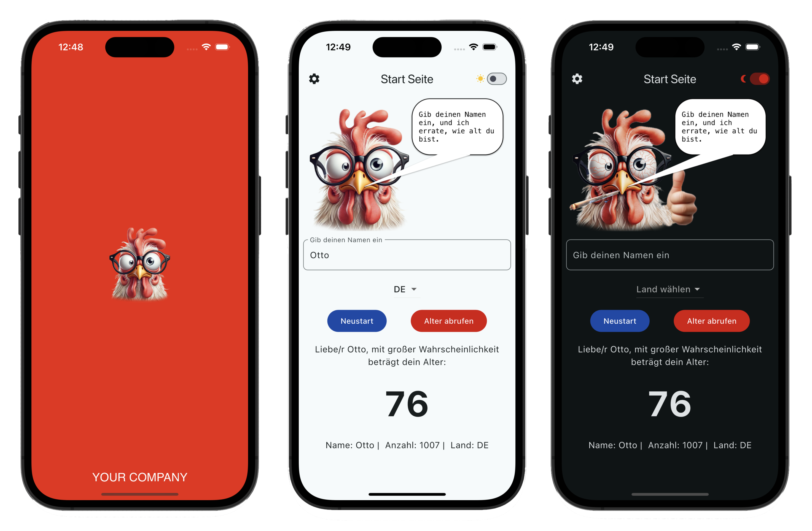

# Flutter Age Prediction App

## Überblick

Dieses Projekt ist eine **Flutter-App**, die das Alter einer Person basierend auf einem Namen schätzt. Die App verwendet die [Agify.io API](https://agify.io/), um das vorhergesagte Alter zu ermitteln.

Der Benutzer kann einen Namen eingeben und optional ein Land aus einem Dropdown-Menü auswählen, um präzisere Ergebnisse zu erhalten. Die App bietet sowohl **light** als auch **dark themes** und unterstützt mehrere Sprachen.

## Funktionalitäten

- **Altersvorhersage**: Geben Sie einen Namen ein, und die App gibt das vorhergesagte Alter zurück, basierend auf Daten aus der Agify.io API.
- **Länderwahl**: Wählen Sie optional ein Land aus, um eine präzisere Vorhersage für den ausgewählten Namen zu erhalten.
- **Mehrsprachigkeit**: Die App ist in **drei Sprachen** lokalisiert: **Deutsch**, **Englisch** und **Russisch**.
- **Themenunterstützung**: Die App unterstützt **light** und **dark themes**, die der Benutzer nach Bedarf wechseln kann.

## Technologie

- **State Management**: Die App verwendet **BLoC** (Business Logic Component) als State-Management-Lösung, um die Logik und den Zustand der App zu verwalten.
- **Localization**: Mehrsprachigkeit wird durch **Sprachlokalisierung** unterstützt, und die App bietet vollständige Übersetzungen für Deutsch, Englisch und Russisch.
- **Themes**: Benutzer können zwischen einem hellen und einem dunklen Thema wechseln, je nach ihren Vorlieben.

## Grafiken

Die in der App verwendeten Grafiken wurden mithilfe von **KI** generiert und anschließend **manuell nachgearbeitet**, um die beste Qualität und Relevanz zu gewährleisten.

## Getestete Geräte

Die App wurde sowohl auf **physischen** als auch auf **virtuellen** Geräten getestet, um eine reibungslose Funktionalität sicherzustellen:

- **Virtuelle Geräte**:
    - Android Emulator: Pixel 8 Pro API TiramisuPrivacySandbox mit Android Version 14
    - iOS Simulator: iPhone 15 (iOS 17.2)

- **Physische Geräte**:
    - Android: Samsung Galaxy S22 Modellname SM-S9o1B/DS mit Android Version 14
    - iOS: iPhone 12 mini mit IOS Version 17.6.1

## Installation und Verwendung

1. **Projekt klonen**:
   ```bash
   git clone https://github.com/yourusername/your-repo-name.git
   cd your-repo-name

1. **App starten**:
   ```bash
   flutter run
## Screenshots


## Sprachen
- **Deutsch**
- **Englisch**
- **Russisch**

## Themen
- **Light Mode**
- **Dark Mode**

## API
Diese App verwendet die [Agify.io API](https://agify.io/), um das Alter basierend auf einem Namen vorherzusagen.
